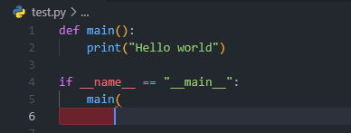

# コードエディターの世界

## コードエディターとは？
エディターとは、プログラム(ソースコード)を記述、編集するために使います。
独立したアプリケーションの場合と、統合開発環境 (IDE)の時があります。
コードエディターを使うとソースコードの記述を高速化され、シンタックスハイライト、自動補完、括弧のマッチング、AI予測補完などの機能が使えます。
またそれぞれの言語に対応したスペルチェック機能、構文チェック機能などがあります。

!!! note "シンタックスハイライト"
    とーても簡単に説明するとソースコードの文字列に色が付き、その文字列が何を指しているのか分かりやすくなります

    { loading=lazy }

!!! note "自動補完"
    文字列入力中に次に連なる字句を推測して優位な候補を提示する機能

!!! note "括弧のマッチング"
    括弧の閉じを推測し、自動で閉じてくれます。
    あまりイメージがないと思うので、気にしなくても大丈夫です。
    (括弧が足りないときも知らせてくれる)

    { loading=lazy }

!!! note "AI予測補完"
    文字列入力中に次に連なる字句をAIが予測してくれる機能もあります。

    { loading=lazy }

とてもシンプルに言うならコードを書くため設計され、エディターによってはプラグインがコミュニティーなどで公開されていたり、開発のために便利な独自機能があったり、他の開発ツール(Githubなど)と連携が出来たりします。

!!! attention "上記の機能について"
    上記の機能はVSCodeのプラグインコミュニティーからインストールしたものです、もしかしたら一部の機能は、他のエディターにない可能性があります

世の中にはいろんなエディターがあるので、好きなのを探してみることをおすすめします。
もし、よくわかなければ、Visual Studio Code(VSCode)にするのが無難だと思います。

## いろんなエディター

!!! quote "無料のテキストエディター"
    TechAcamyマガジンで無料で公開しているエディターを何個か紹介しています。
    是非お気に入りのエディターを見つけてください

    [プログラミングに使える！フリーのテキストエディタ15選](https://techacademy.jp/magazine/986#sec2)(最終アクセス日: 2022/4/10)

!!! tip "興味があれば、IDE (統合開発環境) について調べてみよう"
    [IDE (統合開発環境) とは](https://www.redhat.com/ja/topics/middleware/what-is-ide)(最終アクセス日: 2022/4/10)

    また、Pythonの有名なIDEは

    [Pycharm - プロの開発者向けPython IDE](https://www.jetbrains.com/ja-jp/pycharm/)(最終アクセス日: 2022/4/10)

    などがあります。

## 参考サイト一覧
[コードエディタ | Programming Place Plus　用語集](https://programming-place.net/ppp/contents/glossary/ka/code_editor.html)(最終アクセス日: 2022/4/10)

[コードエディター - Wikipedia](https://ja.wikipedia.org/wiki/%E3%82%BD%E3%83%BC%E3%82%B9%E3%82%B3%E3%83%BC%E3%83%89%E3%82%A8%E3%83%87%E3%82%A3%E3%82%BF)(最終アクセス日: 2022/4/10)

[プログラミングに使える！フリーのテキストエディタ15選](https://techacademy.jp/magazine/986)(最終アクセス日: 2022/4/10)

[自動補完 - wikipedia](https://ja.wikipedia.org/wiki/%E8%87%AA%E5%8B%95%E8%A3%9C%E5%AE%8C)(最終アクセス日: 2022/4/10)
