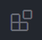
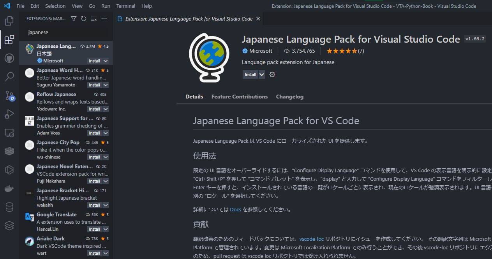
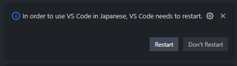
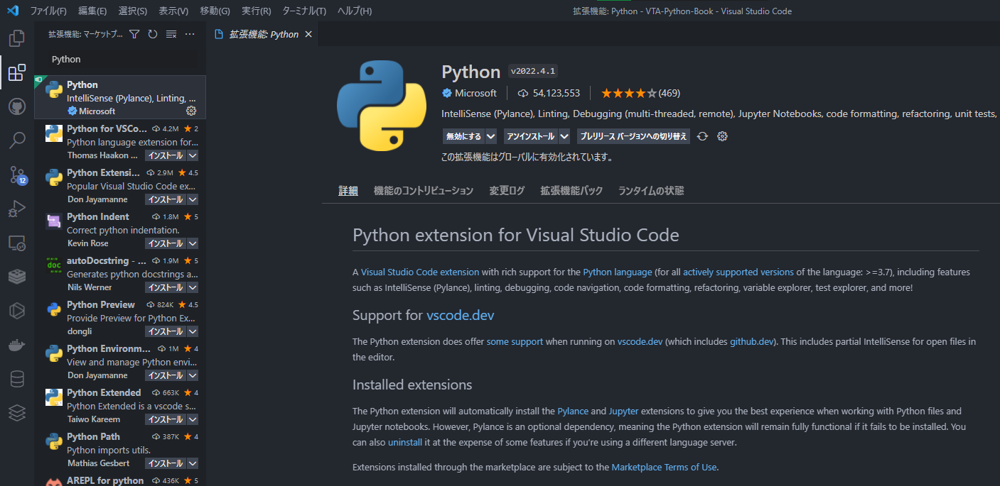

---
tags:
  - エディター　
  - コードエディター
  - VSCode
  - テキストエディター
---

# 1.2.2 VSCodeの設定

## VSCodeの日本語化

VSCodeはインストールされた最初の状態は英語になっているので、

{ loading=lazy }

を押して

{ loading=lazy }

に`japanese` を入力し、以下のパッケージを見つけてください。

<figure markdown>
 { loading=lazy }
</figure>

ダウンロードが終わったら以下のダイヤログが出てくるので、`Restart`を押して再起動してください。

<figure markdown>
{ loading=lazy }
</figure>

同じ容量で、下記のPython packageをインストールしてください

<figure markdown>
{ loading=lazy }
</figure>

## 参考サイト一覧
なし