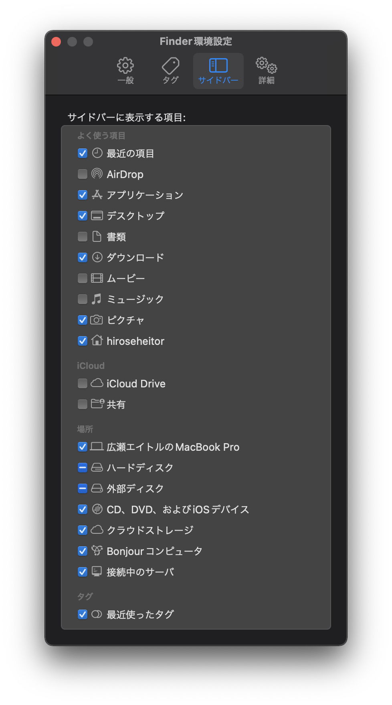
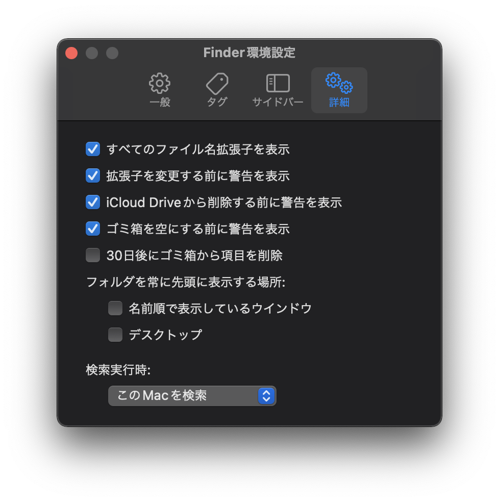

---
tags:
  - 保存方法
  - プロジェクト管理
  - ファイル
  - Finder
  - ファイルマネージャー
---

# おすすめのファイル管理方法

!!! warning "注意事項"
	ここで話すのは、私が考えた楽なファイル管理方法です。Windows10用とMacOS用を作りました。
	自分の好きな管理方法があれば、それを使ってもらっても大丈夫です

やはり、効率のよい開発をするには、整理整頓されたファイルが作業しやすいと僕は思います。
ここでは僕のおすすめなファイル配置なだけで合って'こうして'というわけではないです。
なので、参考程度にしてもらえたら幸いです。

# MacOS
## Finder設定の設定をしよう

初期設定のMacbookでは不便な設定があります。なのでそこを改善していきましょう。

まず、**Finder**を開いて、左上の **「Finder」**（:fontawesome-brands-apple:の右にあります。
出てこない場合は **Finder** をクリックしてみてください）を押して、**「環境設定」** を押してください。

以下のような画像になります。

<figure markdown>
{ style="height: 10%; max-height: 10%;" loading=lazy }
{ style="height: 10%; max-height: 10%;" loading=lazy ß}
</figure>

# Windows10
	10
