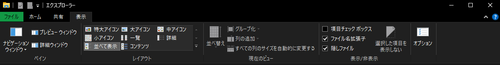

---
tags:
  - 保存方法
  - プロジェクト管理
  - ファイル
  - Finder
  - ファイルマネージャー
---

# おすすめのファイル管理方法

!!! warning "注意事項"
    ここで話すのは、私が考えた楽なファイル管理方法です。Windows10用とMacOS用を作りました。
    自分の好きな管理方法があれば、それを使ってもらっても大丈夫です

やはり、効率のよい開発をするには、整理整頓されたファイルが作業しやすいと僕は思います。
ここでは僕のおすすめなファイル配置なだけで合って'こうして'というわけではないです。
なので、参考程度にしてもらえたら幸いです。

## MacOS
### Finder設定の設定をしよう

初期設定のMacbookでは不便な設定があります。なのでそこを改善していきましょう。

まず、**Finder**を開いて、左上の **「Finder」**（:fontawesome-brands-apple:の右にあります。
出てこない場合は **Finder** をクリックしてみてください）を押して、**「環境設定」** を押してください。

以下のような画像になります。

<figure markdown>
{ style="height: 400px; max-height: 400px;" loading=lazy }
</figure>

まとめると以下の表になります。
自分で必要か必要ないか決めていただいて、設定してもらえれば幸いです。
iCloud使わないので間違ってるものあるかもしれないです。

<figure markdown>
|                       名前                       |                                                                説明                                                                | チェック(私の設定) |
| :--------------------------------------------:  | :--------------------------------------------------------------------------------------------------------------------------------- | :-------: |
|                   `最近の項目`                   |                                               直近で開いた、ダウンロードされたファイル一覧                                             | O |
|                    `AirDrop`                    |                                                      Airdrop受け取れる（たぶん）                                                     | X |
|                `アプリケーション`                |  AppStoreやインターネットからインストールされたアプリが入っているディレクトリー、おそらくLaunchpadがあるので、ほとんど使わないかと思います。   | O |
|                     `書類`                      |                                 書類類を入れる初期フォルダー、iCloudと連携も可能。iPhone勢には便利機能                                   | X |
|                  `ダウンロード`                  |                                        インタネットでダウンロードした物が一時的に配置される場所。                                        | O |
|                    `ムービー`                    |                                  動画類を入れる初期フォルダー、iCloudと連携も可能。iPhone勢には便利機                                   | X |
|                   `ピクチャー`                   |                                   写真類を入れる初期フォルダー、iCloudと連携も可能。iPhone勢には便利機                                  | X |
|                   `パブリック`                   |                                                    好きなファイルを入れるフォルダー                                                   | お気に入り |
|                  `ミュージック`                  |                                   音楽類を入れる初期フォルダー、iCloudと連携も可能。iPhone勢には便利機                                   | X |
| :material-home:`ユーザー名(ユーザーディレクトリー)` |                           書類、ダウンロード、ムービー、ピクチャー、ミュージック、パブリックが入っているフォルダー                        | O |
</figure>

<figure markdown>
{ style="height: 400px; max-height: 400px;" loading=lazy }
</figure>

ここはあまり設定することはありません。
「全てのファイルの拡張子名を表示」をつけことをおすすめします。

### パブリックファイルの扱いについて

僕はMacbookでプログラミング以外のことはしないので、私的なフォルダーがなく、プログラミングのプロジェクトをパブリックに入れてやってます。
ユーザーディレクトリーにプログラミングプロジェクト用のフォルダーを作ってお気に入り登録もいいと思います。
いろいろ調べたり、試したりして、効率のいいプログラミングライフを堪能しましょう！

## Windows10

### 設定

Windowsは隠しファイルを表示できるようにするくらいですね
「隠しファイル」にチェックするだけですね

