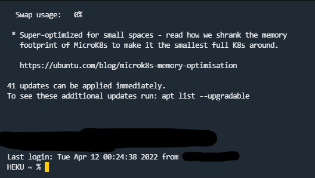

---
tags:
  - ターミナル
  - コマンド
  - 相対パス
  - 絶対パス
  - パス
  - コマンドプロンプト
  - ディレクトリ
  - ファイル
  - フォルダー
---

# ターミナルの扱い方を学ぼう

プログラミングをする上では、ターミナルに対する知識が不可欠です。
また、サーバーなどでは、WindowsやMacOSのような**GUI(ウィンドウやアイコン、ボタン)**あるわけではなく、 ^^全てコマンドで操作^^ する必要があります。

イメージしやすいように、このサイトを動かしているサーバーの画面を持ってきました。

あまり、MacOSのターミナルや、コマンド以外であればWindowsのコマンドプロンプトと変わりません。

<figure markdown>
{ loading=lazy }
今このページを表示しているサーバーの画面
</figure>

上のような画面を操作するためには、絶対パス、相対パスの意味やディレクトリ(フォルダー)の仕組み、
コマンド、OSの仕組みを勉強しなければなりません。

ここでは、よく使うコマンドとディレクトリやファイル、パスについてやっていきましょう。

<pre>

</pre>

まずは、**ファイル**、**ディレクトリ(フォルダー)** とは何かという理解から行きましょう。

## ディレクトリやファイルとはなんなのか？

### ファイルとは？

ファイルとは、パソコンの**データ**などが入ったものです。

パソコンを使って、**HHD**や**USBドライブ**などにデータを保存できたりします。

**ファイル**は ==**OSのファイルシステムによって保存、読み込む、保存場所の移動、削除などの操作ができるように管理されています。**==
その**ファイルシステム**を使って、ファイルに ==**ファイル名**== をつけることができて、ファイルの種類を表す為に ==**拡張子**== をつけることもできます。

<figure markdown>
{ width=300 loading=lazy }
</figure>

皆さんのスマホで取った写真もファイルとして記憶され、その中にどんな写真なのかという情報が入っていたり、
パソコンはそれを読み取って、表示したり、加工したり、複製などいろいろな機能が利用できるようになります。

<pre>

</pre>

### ディレクトリ(フォルダー)とは

ディレクトリとは、ファイルを種類別に分けてしますことができます。また、ディレクトリのディレクトリを作ることができます。これも中身に入ってるものと一緒に削除したり、移動させたり、名前をつけて区別することができます。

凄く簡単に言えば、一か所に大量のファイルを作らない、分類、区別するために使われます。
またそのディレクトリを使って、そのファイルが何処にあるかを表すことができます。
簡単にいえばファイルが何処に保存されているか示すことができます。

またディレクトリとファイルを使った管理を ==**階層構造**== や ==**ファイルツリー**== などと呼ばれています。
そして、全ての階層構造で一番上にあるディレクトリのことを、
==**ルートディレクトリ**== または ==**ルートフォルダー**== と言います。


## パスとはなんなのか？

パスとは、「〇〇ディレクリの中に、〇〇ファイルが入っている」を表した住所です。
ファイルやディレクトリがどこに保存されているか表す事ができます

```
果物ディレクトリの中にある柑橘のディレクトリの中にあるみかん画像ファイル
```

パソコンであれば以下のように表せるようになります。

!!! info "MacOSとWindowsでパスの書き方が違います"
    Windowsは`\`を使っていて、MacOSは`/`を使っています。

    興味ある方は、なぜ違うのか調べてみてください

=== "MacOS"
    ```
    /果物/柑橘/みかん.png
    ```
=== "Windows"
    ```
    \果物\柑橘\みかん.png
    ```

このようなイメージで大丈夫です。

パスの説明が分かりやすくするために以下のような構成のディレクトリーとファイルがあるとします。
最後に`/`がついてるのはディレクトリーで、`.xxx`みたいな拡張子がついた物がファイルです。

??? note "拡張子とは？"
    拡張子とは、ファイルの種類を表す為に使われるものです。ファイル名の後に`.`をつけ、そのあとにファイルの種類を書きます。

    以下の構成の場合は、`.png`が画像のファイルの一種です。

    `.mp4`が動画ファイルの一種で、`.mp3`が音声ファイルの一種です。

    また、`.xlsx`はみんな大好きエクセルファイルを表す拡張子です！

``` title="サンプルのファイルツリー構造"
/ # ルートディレクトリ
├─ favorite_musics.xlsx
├─ music_player.exe
├─ pictures/
│  ├─ image-3.png
│  ├─ image-1.png
│  ├─ image-2.png
├─ video/
│  ├─ gameplay.mp4
│  ├─ blog.mp4
│  ├─ special/
│     ├─ special-day-1.mp4
│     ├─ special-day-2.mp4
│     ├─ special-day-3.mp4
├─ music/
│  ├─ loveinlove.mp3
│  ├─ something_sound.mp3
```

またパスには二週類あります。

## **絶対パス**と**相対パス**
==**絶対パス**== と ==**相対パス**== の違いは、何処からパス(住所)を表すかで変わってきます。
それらの違いを見ていきましょう。

### 絶対パス
**絶対パス** はルートディレクトリからのパスを表した時に使われます。
上のサンプルファイルツリー構造を見て、`videoディレクトリ`の中の`gameplay.mp4`
を取り出したい場合は、以下のようなパスになります。

主な特徴としては、Windowsはドライブの指定が最初について、MacOSは`/`に何もつかずにそのままになります。

=== "MacOS"
    ```
    /video/gameplay.mp4
    ```
=== "Windows"
    ```
    C:\video\gameplay.mp4
    ```

<pre>


</pre>

`musicディレクトリ`の`loveinlove.mp3`の場合
=== "MacOS"
    ```
    /music/loveinlove.mp3
    ```
=== "Windows"
    ```
    C:\music\loveinlove.mp3
    ```

<pre>


</pre>

`videoディレクトリ`の`specialディレクトリ`の中にある`special-day-2.mp4`の場合
=== "MacOS"
    ```
    /video/special/special-day-2.mp4
    ```
=== "Windows"
    ```
    C:\video\special\special-day-2.mp4
    ```

<pre>


</pre>
### 相対パス
相対パスは**カレントディレクトリ**がある場合に表すことができます。
カレントディレクトリとは何かというと自分がアクセスしているディレクトリのことを指します。
今開いてるターミナルが何処のディレクトリをアクセスしているかあるコマンドで確認することができます！

#### ターミナルで自分のカレントディレクトリを確認してみよう！
WindowsとMacOSでは、カレントディレクトリを確認するコマンドは違いがあります。
以下のコマンドを実行すれば確認することができます。
是非実行してみましょう！

=== "MasOS"
    ``` title="ターミナル"
    pwd
    ```
    と実行すると以下のような文字が表示されます。
    ``` title="ターミナル"
    $ pwd
    /Users/<あなたのユーザー名>
    ```
=== "Windows"
    ``` title="コマンドプロンプト"
    cd
    ```
    と実行すると以下のような文字が表示されます。
    ``` title="コマンドプロンプト"
    C:\Users\<あなたのユーザー名>> cd
    C:\Users\<あなたのユーザー名>
    ```

#### パスでカレントディレクトリを表してみよう！
パスでカレントディレクトリを表す場合は`./`を最初につけます。
最初にスラッシュもしくはバックスラッシュをつけずにそのまま書かず省略することもできます

```
# 省略せずに書いた場合
./pictures/image-3.png

# 省略した場合
pictures/image-3.png
```

``` title="サンプルのファイルツリー構造"
/ # ルートディレクトリ
├─ favorite_musics.xlsx
├─ music_player.exe
├─ pictures/
│  ├─ image-3.png
│  ├─ image-1.png
│  ├─ image-2.png
├─ video/
│  ├─ gameplay.mp4
│  ├─ blog.mp4
│  ├─ special/
│     ├─ special-day-1.mp4
│     ├─ special-day-2.mp4
│     ├─ special-day-3.mp4
├─ music/
│  ├─ loveinlove.mp3
│  ├─ something_sound.mp3
```

上のサンプルからカレントディレクトリが`videoディレクトリ`として、`gameplay.mp4`を表したい場合は、以下のようになります。

=== "MasOS"
    ```
    ./gameplay.mp4
    ```
=== "Windows"
    ```
    .\gameplay.mp4
    ```

上のサンプルからカレントディレクトリが`videoディレクトリ`として、
`specialディレクトリ`の中にある`special-day-3.mp4`を表したい場合は、以下のようになります。

=== "MasOS"
    ```
    ./special/special-day-3.mp4
    ```
=== "Windows"
    ```
    .\special\special-day-3.mp4
    ```

では、カレントディレクトリを`specialディレクトリ`として、
ルートディレクトリにある`favorite_musics.xlsx`を取り出したい場合はどうすればいいのでしょうか？

結論を言えば、階層を1つ戻る必要があります。戻るには、`../`を使います。なので上のパスを表現したい場合は下のようになります。

=== "MasOS"
    ```
    # イメージは下のような感じです。
    # 現在のディレクトリ/video/ルートディレクトリ
    ./../../favorite_musics.xlsx
    ```
=== "Windows"
    ```
    # イメージは下のような感じです。
    # 現在のディレクトリ\video\ルートディレクトリ
    .\..\..\favorite_musics.xlsx
    ```


## ターミナルで扱う基本的なコマンド

いよいよ本題です。

MacOSやWindowsにはいろいろなコマンドがあります。その中で基本的なものをここで紹介していこうと思います。
OSによって、ターミナル操作に使うコマンドが変わってきますが、ここではどのターミナルにもあるカレントディレクトリ移動、ディレクトリ削除などを紹介していきます。

### カレントディレクトリの移動、確認
ターミナル操作で一番重要な部分です、MacOSでカレントディレクトリの移動は、
`cd`コマンドを使います。またWindowsの`cd`コマンドと機能が似ていますが、
別物なので注意してください。

=== "MacOS"
    カレントディレクトリの移動は以下のコマンドでできます。
    ``` title="ターミナル"
    cd <移動したいディレクトリの相対パス、もしくは絶対パス>
    ```

    !!! tip "MacOSのcdコマンドのオプションについて"
        MacOSの`cd`コマンドはオプションはありますが、特に重要ではないので、ここでは紹介しません。
        興味ある方は是非調べて見てください

    また、以下のコマンドで前回のカレントディレクトリに戻ることができます。
    ``` title="ターミナル"
    cd -
    ```

    そして、`cd`コマンドを使ってホームディレクトリに戻ることができます。

    ??? info "ホームディレクトリとは？"
        ユーザーに割り当てられた自由にファイルを作れる空間です。
        どのOSにもユーザーというものがあり、作成や削除もできます。
        大体のOSはログインしたユーザーのホームディレクトリがターミナル起動した時に
        カレントディレクトリになってると思います。
        MacOSの場合は`Desktop`、`Pictures`、`Public`などのファイルが最初から自動で作られています。

    ``` title="ターミナル"
    cd ~
    ```
    または
    ``` title="ターミナル"
    cd
    ```

=== "Windows"
    カレントディレクトリの移動は以下のコマンドでできます。
    ``` title="コマンドプロンプト"
    cd <移動したいディレクトリの相対パス、もしくは絶対パス>
    ```

    Windowsは`cd`コマンドにあるオプションは、ドライブ変更のみです。
    ``` title="コマンドプロンプト"
    cd /D <移動したいドライブ名>
    ```
    `H:`ドライブに移動したいなら下のようなコマンドになります。
    ``` title="コマンドプロンプト"
    cd /D H:
    ```

    カレントディレクトリの移動以外にも、今どこのディレクトリがカレントディレクトリになっているか確認することができます。
    ``` title="コマンドプロンプト"
    cd
    ```

    上のコマンドを使ってホームディレクトリに移動することもできます。

    ??? info "ホームディレクトリとは？"
        ユーザーに割り当てられた自由にファイルを作れる空間です。
        どのOSにもユーザーというものがあり、作成や削除もできます。
        大体のOSはログインしたユーザーのホームディレクトリがターミナル起動した時に
        カレントディレクトリになってると思います。
        Windows10の場合は`デスクトップ`、`ピクチャ`、`ミュージック`などのファイルが最初から自動で作られています。

    ``` title="コマンドプロンプト"
    cd %homepath%
    ```

    また`cd`コマンドは`chdir`コマンドの略なので、`chdir`でも問題ありません。

    詳しいことは、[Microsoftの公式ドキュメント](https://docs.microsoft.com/ja-jp/windows-server/administration/windows-commands/cd)から見ることができます。

### ファイルの作成
ファイルを作る時によく使うコマンドです。

=== "MasOS"
    ファイル作成には、`touch`コマンドを使うことで作成できます。
    元々は、ファイルのアクセス時刻を変更するコマンドですが、
    ファイルが存在しない場合は作成してくれる機能が使えます。

    ``` title="ターミナル"
    touch <作りたいファイル名>
    ```

    main.pyを作るならこのようになります。

    ``` title="ターミナル"
    touch main.py
    ```

=== "Windows"
    ファイル作成には、`type`コマンドを使うことで作成できます。

    !!! info "copyコマンドも代用として使用できます"

    !!! warning "ファイルが存在する場合はそのまま上書きされます。"

    ``` title="コマンドプロンプト"
    type nul > hoge.txt
    ```

    main.pyを作るならこのようになります。

    ``` title="コマンドプロンプト"
    type nul > main.py
    ```

### ディレクトリの作成
ディレクトリを作る時によく使うコマンドです。
`mkdir`コマンドを使います。またWindowsの`mkdir`コマンドと機能が似ていますが、
別物なので注意してください。

=== "MasOS"
    ディレクトリ作成は、`mkdir`コマンドを使うことで作成できます。

    ``` title="ターミナル"
    mkdir <ディレクトリを作成したいディレクトリの相対パスまたは絶対パス/作成したいディレクトリ名>
    ```

    `Public`ディレクトリの中に`Python`ディレクトリを作成したい場合
    ``` title="ターミナル"
    mkdir Public/Python/
    ```

    ホームディレクトリの中に`Rust`ディレクトリを作りたい場合
    ``` title="ターミナル"
    mkdir ~/Rust/
    ```

=== "Windows"
    ディレクトリ作成は、`md`コマンドを使うことで作成できます。

    ``` title="コマンドプロンプト"
    md <ディレクトリを作成したいディレクトリの相対パスまたは絶対パス/作成したいディレクトリ名>
    ```

    `Public`ディレクトリの中に`Python`ディレクトリを作成したい場合
    ``` title="ターミナル"
    md Public\Python\
    ```

    ホームディレクトリの中に`Rust`ディレクトリを作りたい場合
    ``` title="ターミナル"
    md %homepath%\Rust\
    ```

    また`md`コマンドは`mkdir`コマンドの略なので、`mkdir`でも問題ありません。

### ファイル・ディレクトリの削除
空のディレクトリを削除するときと、中身が入ってるディレクトリを削除する時は
少しコマンドがかかわるのでややこしいです。

??? danger "絶対に、絶対に、絶対にルートディレクトリー、ホームディレクトリを削除しないでください。"
    **本当にやらないでください。
    後悔しますよ、
    本当に、、**

=== "MasOS"
    本当に削除するかの確認が出てきますので、出てきた場合は、
    y (Yes) / n (No) のどちらかを入力して、 ++enter++ で実行してください

    **空のディレクトリを削除する場合**

    ``` title="ターミナル"
    rmdir <削除したいディレクトリの相対パスまたは絶対パス>
    ```

    **中身が入っているファイルを削除する場合**

    ``` title="ターミナル"
    rm -r <削除したいディレクトリの相対パスまたは絶対パス>
    ```

=== "Windows"
    本当に削除するかの確認が出てきますので、出てきた場合は、
    y (Yes) / n (No) のどちらかを入力して、 ++enter++ で実行してください

    **空のディレクトリを削除する場合**

    ``` title="コマンドプロンプト"
    rd <削除したいディレクトリの相対パスまたは絶対パス>
    ```

    **中身が入っているファイルを削除する場合**

    ``` title="コマンドプロンプト"
    rd /s <削除したいディレクトリの相対パスまたは絶対パス>
    ```

    また`rd`コマンドは`rmdir
    `コマンドの略なので、`mkdir`でも問題ありません。

### ファイルを開くまたは実行する

=== "MasOS"
    MacOSでファイルを開くには`open`コマンドを使います。

    ``` title="ターミナル"
    open <開きたいファイルの相対パスまたは絶対パス>
    ```

=== "Windows"
    Windowsではコマンドを使わずに、ただパスを書くだけで開きます。

    ``` title="コマンドプロンプト"
    <開きたいファイルの相対パスまたは絶対パス>
    ```

## 豆知識編

### 補完

++tab++を押すとコマンドや、ディレクトリ、ファイルを置き換えしてくれます。
シェルやOSによってはしてくれないですけど、MacOSのターミナルは使えるので是非使ってみてください。

## 参考リンク一覧

[Windows のコマンド](https://docs.microsoft.com/ja-jp/windows-server/administration/windows-commands/windows-commands)

[cdコマンドの使い方を簡単にご紹介【Windowsコマンド集】](https://eng-entrance.com/windows-command-cd)

[windowsのホームディレクトリ](https://teratail.com/questions/172434)

[touch - ファイルのアクセス時刻と修正時刻を変更する](http://command.appios.net/touch.1.html)

[Qiita - ターミナル学習まとめ](https://qiita.com/Cesaroshun/items/eaf4b4e3f847062ca308)

[Windows - mkdir command](https://docs.microsoft.com/ja-jp/windows-server/administration/windows-commands/mkdir)

[Windows - rd command](https://docs.microsoft.com/ja-jp/windows-server/administration/windows-commands/rd)

[rdコマンドの使い方を簡単にご紹介【Windowsコマンド集】](https://eng-entrance.com/windows-command-rd)