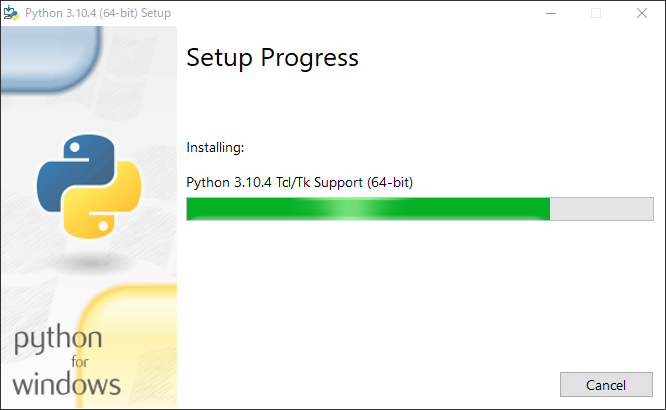

---
tags:
  - 環境構築
  - Windows10
  - pyenv
  - Python
  - インストール
  - ターミナル
  - Python基礎
---

# Pythonインストール Windows10編

!!! warning ":snake: Anacondaのインストールについて"
    先生がanacondaをインストールを指定している場合は、先生の指示に従ってインストールをお願いします。
    去年(2021年)では指定されましたが、anacondaである必要ないと私は思ったので、めんどくさいエラーを避けたいなら普通のPythonのインストールをお勧めします。
    ただ今年と同じ授業するのかわからないので先生に聴いて判断をしてください。

## Let's インストール

### インストール手順
- 公式サイトからインストーラーをダウンロード
- インストーラーを起動
- インストーラーを開いたら`Add Python 3.10 to PATH`にチェックをつける
- `Install Now` を押す
- `close` を押す
- インストールされた確認する

### インストーラーをダウンロード

公式サイトからダウンロードしてください。

[Python 3.10 - download](https://www.python.org/downloads/)

`Download Python X.X.X`を押してダウンロードをしてください

### インストーラー

#### 起動
インストーラーを起動してください。
起動したらこうなるはずです。

<figure markdown>
{ loading=lazy }
</figure>

#### PATH設定

その後に、下にある`Add Python X.X to PATH`にチェックをつけてください。

!!! danger
    これを忘れるとターミナルからのコマンド実行するための設定を手動でやらないといけなくなります

<figure markdown>
{ loading=lazy }
</figure>

#### インストール中

インストール中

<figure markdown>
{ loading=lazy }
</figure>

#### インストール終了
インストールが終わったらこうなるはずです

<figure markdown>
{ loading=lazy }
</figure>

#### インストールされているか確認

++windows++ を押して、検索欄に`cmd`と書いて、ターミナルを起動して下さい。

<figure markdown>
{ loading=lazy }
</figure>

ターミナルに以下のコマンドを打って以下の写真のような結果になったら成功です。

```cmd title="cmd"
python -V
```
を実行してこう返ってこれば成功です
```cmd title="cmd"
Python X.X.X
```

<figure markdown>
{ loading=lazy }
</figure>

## 参考サイト一覧
なし